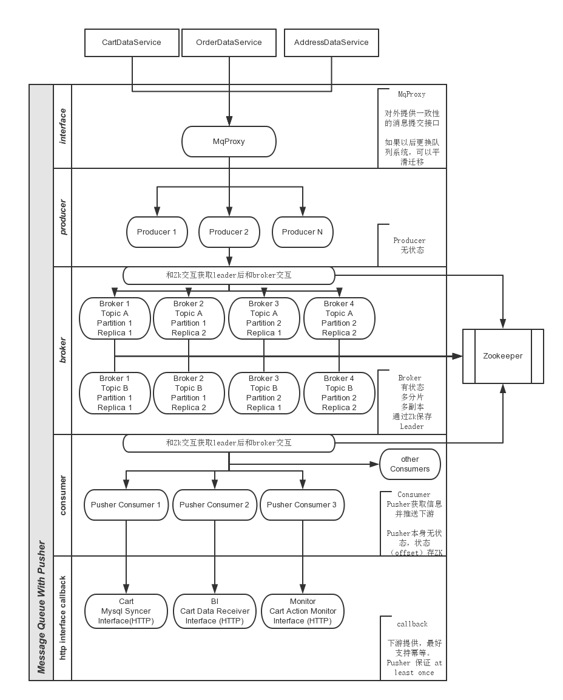

#消息系统设计

##背景

在架构演进中，有若干种场景需要可靠的队列服务来传递数据或消息，这些场景有：

* 异构系统的数据同步，如购物车的数据存储在redis中，并落地到mysql，为了保证性能可可扩展性，通过消息队列来执行数据的落地操作。
* 系统间数据同步，如交易系统和支付系统。
* 事件的异步处理，如下单后发券等。

综合各种场景，对消息队列的要求抽象为：

* 高可用，消息队列服务应当保持尽可能高（>99.999%）的可用性，尤其写队列的操作。
* 低延迟，单次写队列的操作，可以在1ms内完成。
* 可扩展，当多个业务接入时，随着消息量的增长，应该是容易扩展且对上下游是透明的。
* 消息的安全性，保证消息不丢失，且可以回放（回放限度可控制在一周内）。
* 接入成本低，各类语言的上下游，应该容易接入消息系统。

##总架构图



说明：

* MqProxy

	各上游子系统（如CartDataService/OrderDataService)，通过统一的MqProxy来提交消息。

	MqProxy提供HTTP接口，上游提交消息时，声明Topic和消息内容。
	
	MqProxy和Zookeeper保持长连接，以加速（实测PHP访问Zk大概有10-20ms的耗时，无法接受）。
	
	MqProxy来处理消息的分片，在提交消息给MqProxy时，同时提供Partition Key。
	
	MqProxy见https://github.com/crask/mqproxy
	
* Producer

	MqProxy作为Producer将消息提交到Kafka。
		
* Broker

	参考Kafka的系统架构，Broker部分提供对某个Topic的Partation和Replica机制，即每一个Topic的数据，都可按某个主键进行分片，并支持多个副本。
	
	Broker需要实现Leader选举机制，并通过Zookeeper保存各Topic/Partation的Leader。
	
	Producer和Broker交互之前，通过Zookeeper获得对应Leader，而后进行交互。
	
	Broker是易扩展的。
	
* Consumer

	Consumer可支持队列服务本身的Consumer机制。
	
	然而，现在的系统，大部分是PHP这样的系统，并不是通过deamon方式运行的，因此我们需要实现一个Pusher机制，使得消息的消费从拉模型变为推模型，使得下游需要接受消息的子系统，更低成本的接入。
	
	因此，我们实现一套Push Consumer机制。
	
* Pusher Consumer

	Pusher Consumer是可配置的常驻服务，可指定Topic->url，支持多个。

	配置文件举例：
	
	```
	{
	    "consumer_groups": [                //support multi callback url
	        {
	            "worker_num": 16,
	            "url": "http://localhost",  //callback url
	            "retry_times": 4,           //will retry if the callback request response non 200 code
	            "bypass_failed":true,       //auto jump to next if single message were processed failed,set to false if service need to process message exactlly
	            "failed_sleep":"12s",       //when bypass_failed set to true,sleep this time before retry
	            "timeout": "3s",            //the callback time
	            "topics": [                 //topic(s) consumed
	                "t1"
	            ],
	            "zookeepers": [             //zookeeper hosts
	                "127.0.0.1:2181"
	            ],
	        },
	        {
	            "url": "http://localhost/api/b",
	            "retry_times": 4,
	            "bypass_failed":false,
	            "failed_sleep":"2s",
	            "timeout": "1s",
	            "topics": [
	                "m2"
	            ],
	            "zookeepers": [
	                "127.0.0.1:2181"
	            ],
	            "zk_path": "/chroot"
	        }
	    ]
	}
	
	```
	
	pusher consumer会将消息有序推送到下游系统，各个下游系统都能够拿到所有的消息，且进度各自独立，互不影响。
	
	pusher consumer通过zookeeper保存各个下游当前的命令点，因此也是无状态的。
	
	Pusher见https://github.com/crask/kafka-pusher。
	
* http interface callback

	下游接受消息的接口，提供统一的消息接受格式。
	
	同时，由于Pusher Consumer采用at least once的方式（即消息至少传输一次，由于网络等原因导致的超时或出错，pusher会自动重发直到超过retry或者返回成功），建议下游的接口是幂等的，即多次调用也不会使得状态错误。
	
	
## 队列服务选型

队列服务的选型，见队列服务调研。

最终选取Kafka作为队列中间件的实现。

同时，考虑到避免我们对Kafka的熟悉程度，为了避免风险，可以实现一套mysql的队列机制。

其具体方案要点是：

1. 按照topic，在mysql中建立N个表，broker将消息存储在mysql表中。
2. pusher读取表来消费队列，在mysql中记录消费的主键id。
	
这个方案的性能和扩展性都比较差，仅做应急使用。

## pusher consumer的实现

pusher的实现有几个要点:

1. pusher服务应该是无状态的。
2. pusher服务，对一个topic的一个partation，应该能开启多个，但同一时间只有一个work（保证消息是有序的），一旦worker挂掉，另外的worker能够立即开始工作。
3. 对于不同的下游，不应该互相影响，一个下游长耗时或其他原因堵命令，不能影响其他下游。


用golang的kafka sdk + httpclient，可实现一个这样的服务。

同时，为了保证在极端情况下问题快速得到解决，可以用php重复实现一个pusher备用。

pusher应该支持kafka和mysql两种队列服务。